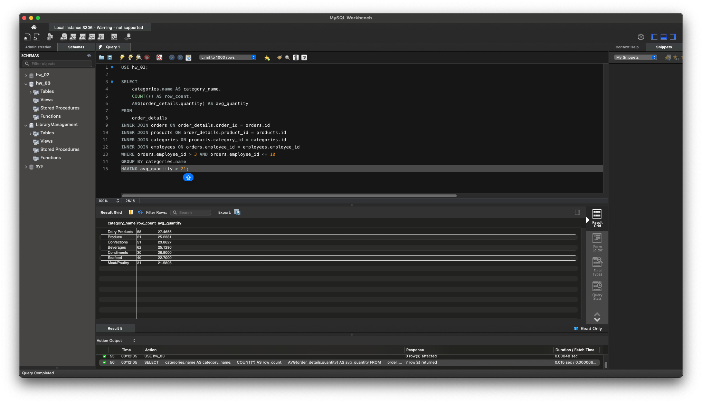

# Домашнє завдання до Теми 4. DML та DDL команди. Складні SQL вирази

1. Створіть базу даних для керування бібліотекою книг згідно зі структурою, наведеною нижче. Використовуйте DDL-команди для створення необхідних таблиць та їх зв'язків.

**Структура БД**

a) Назва схеми — “`LibraryManagement`”

b) Таблиця "`authors`":
* `author_id` (INT, автоматично зростаючий PRIMARY KEY)
* `author_name` (VARCHAR)

c) Таблиця "`genres`":
* `genre_id` (INT, автоматично зростаючий PRIMARY KEY)
* `genre_name` (VARCHAR)

d) Таблиця "`books`":
* `book_id` (INT, автоматично зростаючий PRIMARY KEY)
* `title` (VARCHAR)
* `publication_year` (YEAR)
* `author_id` (INT, FOREIGN KEY зв'язок з "Authors")
* `genre_id` (INT, FOREIGN KEY зв'язок з "Genres")

e) Таблиця "`users`":
* `user_id` (INT, автоматично зростаючий PRIMARY KEY)
* `username` (VARCHAR)
* `email` (VARCHAR)

f) Таблиця "`borrowed_books`":
* `borrow_id` (INT, автоматично зростаючий PRIMARY KEY)
* `book_id` (INT, FOREIGN KEY зв'язок з "Books")
* `user_id` (INT, FOREIGN KEY зв'язок з "Users")
* `borrow_date` (DATE)
* `return_date` (DATE)
```SQL 
-- 1. Створення бази даних
CREATE DATABASE IF NOT EXISTS LibraryManagement;
USE LibraryManagement;

-- 2. Таблиця authors
CREATE TABLE authors (
    author_id INT AUTO_INCREMENT PRIMARY KEY,
    author_name VARCHAR(255) NOT NULL
);

-- 3. Таблиця genres
CREATE TABLE genres (
    genre_id INT AUTO_INCREMENT PRIMARY KEY,
    genre_name VARCHAR(255) NOT NULL
);

-- 4. Таблиця books
CREATE TABLE books (
    book_id INT AUTO_INCREMENT PRIMARY KEY,
    title VARCHAR(255) NOT NULL,
    publication_year YEAR,
    author_id INT,
    genre_id INT,
    FOREIGN KEY (author_id) REFERENCES authors(author_id),
    FOREIGN KEY (genre_id) REFERENCES genres(genre_id)
);

-- 5. Таблиця users
CREATE TABLE users (
    user_id INT AUTO_INCREMENT PRIMARY KEY,
    username VARCHAR(255) NOT NULL,
    email VARCHAR(255) NOT NULL
);

-- 6. Таблиця borrowed_books
CREATE TABLE borrowed_books (
    borrow_id INT AUTO_INCREMENT PRIMARY KEY,
    book_id INT,
    user_id INT,
    borrow_date DATE,
    return_date DATE,
    FOREIGN KEY (book_id) REFERENCES books(book_id),
    FOREIGN KEY (user_id) REFERENCES users(user_id)
);
```

2. Заповніть таблиці простими видуманими тестовими даними. Достатньо одного-двох рядків у кожну таблицю.
```SQL 
USE LibraryManagement;

-- Переведемо рік в INT
ALTER TABLE books MODIFY publication_year INT;

-- authors
INSERT INTO authors (author_name) VALUES ('Тарас Шевченко');
INSERT INTO authors (author_name) VALUES ('Ліна Костенко');

-- genres
INSERT INTO genres (genre_name) VALUES ('Поезія');
INSERT INTO genres (genre_name) VALUES ('Роман');

-- books
INSERT INTO books (title, publication_year, author_id, genre_id) VALUES ('Кобзар', 1840, 1, 1);
INSERT INTO books (title, publication_year, author_id, genre_id) VALUES ('Маруся Чурай', 1979, 2, 2);

-- users
INSERT INTO users (username, email) VALUES ('ivan123', 'ivan@example.com');
INSERT INTO users (username, email) VALUES ('olena456', 'olena@example.com');

-- borrowed_books
INSERT INTO borrowed_books (book_id, user_id, borrow_date, return_date) VALUES (1, 1, '2025-06-01', '2025-06-15');
INSERT INTO borrowed_books (book_id, user_id, borrow_date, return_date) VALUES (2, 2, '2025-06-05', NULL);
```
>Для історичних книг краще використовувати `INT` для року, бо тип `YEAR` дуже обмежений (1901-2155)


3. Перейдіть до бази даних, з якою працювали у темі 3. Напишіть запит за допомогою операторів FROM та INNER JOIN, що об’єднує всі таблиці даних, які ми завантажили з файлів: order_details, orders, customers, products, categories, employees, shippers, suppliers. Для цього ви маєте знайти спільні ключі.
Перевірте правильність виконання запиту.
```SQL 
USE hw_03;

SELECT 
    order_details.*,
    orders.date,
    customers.name,
    products.name,
    categories.name,
    employees.first_name,
    employees.last_name,
    shippers.name,
    suppliers.name
FROM 
    order_details
INNER JOIN orders ON order_details.order_id = orders.id
INNER JOIN customers ON orders.customer_id = customers.id
INNER JOIN products ON order_details.product_id = products.id
INNER JOIN categories ON products.category_id = categories.id
INNER JOIN employees ON orders.employee_id = employees.employee_id
INNER JOIN shippers ON orders.shipper_id = shippers.id
INNER JOIN suppliers ON products.supplier_id = suppliers.id;
```


4. Виконайте запити, перелічені нижче:
   * Визначте, скільки рядків ви отримали (за допомогою оператора COUNT).
```SQL 
SELECT COUNT(*)
FROM 
    order_details
INNER JOIN orders ON order_details.order_id = orders.id
INNER JOIN customers ON orders.customer_id = customers.id
INNER JOIN products ON order_details.product_id = products.id
INNER JOIN categories ON products.category_id = categories.id
INNER JOIN employees ON orders.employee_id = employees.employee_id
INNER JOIN shippers ON orders.shipper_id = shippers.id
INNER JOIN suppliers ON products.supplier_id = suppliers.id;
```

   * Змініть декілька операторів INNER на LEFT чи RIGHT. Визначте, що відбувається з кількістю рядків. Чому? Напишіть відповідь у текстовому файлі.
```SQL 
SELECT COUNT(*)
FROM 
    order_details
LEFT JOIN orders ON order_details.order_id = orders.id
LEFT JOIN customers ON orders.customer_id = customers.id
LEFT JOIN products ON order_details.product_id = products.id
LEFT JOIN categories ON products.category_id = categories.id
LEFT JOIN employees ON orders.employee_id = employees.employee_id
LEFT JOIN shippers ON orders.shipper_id = shippers.id
LEFT JOIN suppliers ON products.supplier_id = suppliers.id;
```
> Якщо змінити декілька операторів `INNER JOIN` на `LEFT JOIN`, кількість рядків у результаті може збільшитись або залишитись незмінною (але не зменшитись). Це відбувається тому, що `INNER JOIN` повертає лише ті рядки, для яких є співпадіння у всіх таблицях, а `LEFT JOIN` повертає всі рядки з лівої таблиці (у нашому випадку — з `order_details`), навіть якщо немає співпадіння у приєднаних таблицях. Для таких рядків поля приєднаних таблиць будуть заповнені `NULL`.


   * На основі запита з пункта 3 виконайте наступне: оберіть тільки ті рядки, де employee_id > 3 та ≤ 10.
```SQL 
SELECT 
    order_details.*,
    orders.date,
    customers.name AS customer_name,
    products.name AS product_name,
    categories.name AS category_name,
    employees.first_name,
    employees.last_name,
    shippers.name AS shipper_name,
    suppliers.name AS supplier_name
FROM 
    order_details
INNER JOIN orders ON order_details.order_id = orders.id
INNER JOIN customers ON orders.customer_id = customers.id
INNER JOIN products ON order_details.product_id = products.id
INNER JOIN categories ON products.category_id = categories.id
INNER JOIN employees ON orders.employee_id = employees.employee_id
INNER JOIN shippers ON orders.shipper_id = shippers.id
INNER JOIN suppliers ON products.supplier_id = suppliers.id
WHERE orders.employee_id > 3 AND orders.employee_id <= 10;
```

   * Згрупуйте за іменем категорії, порахуйте кількість рядків у групі, середню кількість товару (кількість товару знаходиться в order_details.quantity)
```SQL 
SELECT 
    categories.name AS category_name,
    COUNT(*) AS row_count,
    AVG(order_details.quantity) AS avg_quantity
FROM 
    order_details
INNER JOIN orders ON order_details.order_id = orders.id
INNER JOIN products ON order_details.product_id = products.id
INNER JOIN categories ON products.category_id = categories.id
INNER JOIN employees ON orders.employee_id = employees.employee_id
WHERE orders.employee_id > 3 AND orders.employee_id <= 10
GROUP BY categories.name;
```

   * Відфільтруйте рядки, де середня кількість товару більша за 21.
```SQL 
SELECT 
    categories.name AS category_name,
    COUNT(*) AS row_count,
    AVG(order_details.quantity) AS avg_quantity
FROM 
    order_details
INNER JOIN orders ON order_details.order_id = orders.id
INNER JOIN products ON order_details.product_id = products.id
INNER JOIN categories ON products.category_id = categories.id
INNER JOIN employees ON orders.employee_id = employees.employee_id
WHERE orders.employee_id > 3 AND orders.employee_id <= 10
GROUP BY categories.name
HAVING avg_quantity > 21;
```

   * Відсортуйте рядки за спаданням кількості рядків.
```SQL 
SELECT 
    categories.name AS category_name,
    COUNT(*) AS row_count,
    AVG(order_details.quantity) AS avg_quantity
FROM 
    order_details
INNER JOIN orders ON order_details.order_id = orders.id
INNER JOIN products ON order_details.product_id = products.id
INNER JOIN categories ON products.category_id = categories.id
INNER JOIN employees ON orders.employee_id = employees.employee_id
WHERE orders.employee_id > 3 AND orders.employee_id <= 10
GROUP BY categories.name
HAVING avg_quantity > 21
ORDER BY row_count DESC;
```

   * Виведіть на екран (оберіть) чотири рядки з пропущеним першим рядком.
```SQL 
SELECT 
    categories.name AS category_name,
    COUNT(*) AS row_count,
    AVG(order_details.quantity) AS avg_quantity
FROM 
    order_details
INNER JOIN orders ON order_details.order_id = orders.id
INNER JOIN products ON order_details.product_id = products.id
INNER JOIN categories ON products.category_id = categories.id
INNER JOIN employees ON orders.employee_id = employees.employee_id
WHERE orders.employee_id > 3 AND orders.employee_id <= 10
GROUP BY categories.name
HAVING avg_quantity > 21
ORDER BY row_count DESC
LIMIT 4 OFFSET 1;
```
